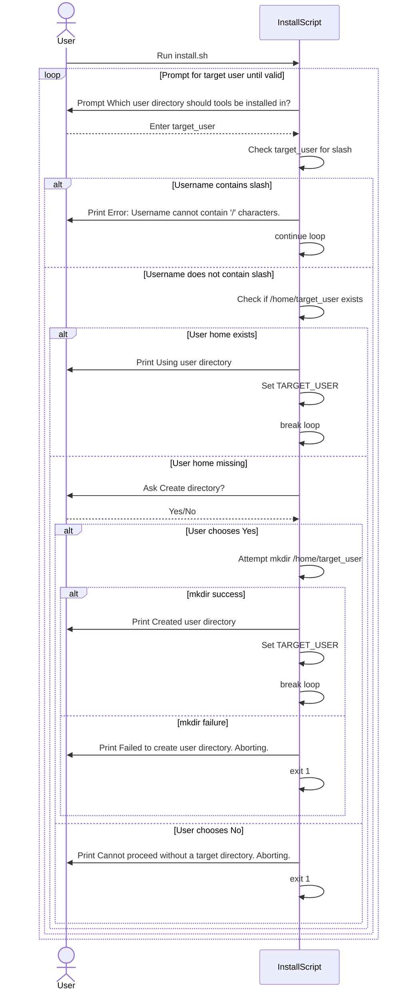
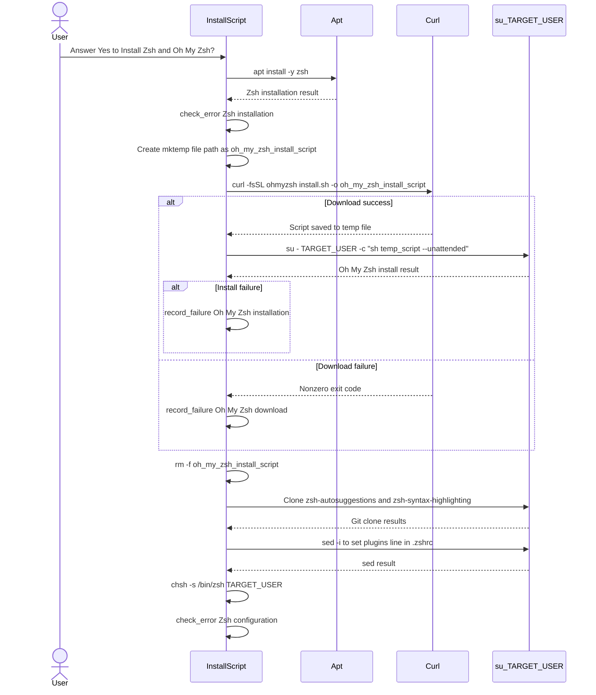

# Diagrams from Pull Request #5

## Sequence Diagram for prompt_target_user with Sanitized Input and Abort Paths

## Sequence Diagram for Secure Oh My Zsh Installation

## Flow Diagram for Updated install.sh Execution Phases

```mermaid
flowchart TD
    A_Start[Start install.sh] --> B_PromptUser[Prompt and validate TARGET_USER]
    B_PromptUser -->|Valid user dir or created| C_CorePackages[Install core system tools]

    C_CorePackages --> D_Recon[Prompt and install reconnaissance tools]
    D_Recon --> E_WebExploit[Prompt and install web exploitation tools]
    E_WebExploit --> F_RevEng[Prompt and install reverse engineering tools]
    F_RevEng --> G_Forensics[Prompt and install forensics tools]
    G_Forensics --> H_PasswordCracking[Prompt and install password cracking tools]
    H_PasswordCracking --> I_ExploitDev[Prompt and install exploit development tools]

    I_ExploitDev --> J_CreateCTFDir[Create /home/TARGET_USER/CTF]
    J_CreateCTFDir --> K_Venv[Create Python venv in CTF/venv]
    K_Venv --> L_PythonDeps[Install Python packages in venv]

    L_PythonDeps --> M_ToolsDir[Create /home/TARGET_USER/tools]
    M_ToolsDir --> N_SecLists[Optional SecLists download into tools]

    N_SecLists --> O_CTFSubdirs[Create CTF subdirectories]
    O_CTFSubdirs --> P_NotesGit[Initialize Git in CTF/notes if no repo]

    P_NotesGit --> Q_BashAliases[Configure bash aliases in .bashrc]

    Q_BashAliases --> R_SysConfig[Apply system config tweaks]
    R_SysConfig --> R1_Watch[Increase inotify watch limits]
    R1_Watch --> R2_Firewall[Install and configure ufw rules]
    R2_Firewall --> R3_DisableSvcs[Disable bluetooth and cups]

    R3_DisableSvcs --> S_Editors[Install editors and optional VS Code]

    S_Editors --> T_TestEnvs[Optional test environments installation]

    T_TestEnvs --> U_Zsh[Optional Zsh and Oh My Zsh secure install]

    U_Zsh --> V_Cleanup[Final cleanup for TARGET_USER cache and history]

    V_Cleanup --> W_ProxyChains[Optional ProxyChains configuration]

    W_ProxyChains --> X_NerdFonts[Optional Nerd Fonts installation]

    X_NerdFonts --> Y_Verify[Run tool verification and log results]

    Y_Verify --> Z_End[Show failures summary and finish]
```

## Summary by Sourcery

Harden and streamline the Kali install script with safer user handling, expanded tool category installation, and more reliable environment setup and cleanup.

### New Features:
- Add reconnaissance, forensics, and password-cracking tool groups as optional installation steps.
- Create CTF and tools directories early in the process and set up a Python virtual environment within the CTF workspace.
- Add configuration for firewall, file watch limits, editors (including optional VS Code), and ProxyChains as part of the setup.
- Provide an optional Oh My Zsh installation using a temporary downloaded script and idempotent plugin configuration.

### Bug Fixes:
- Validate the target username to prevent invalid paths and handle failures to create the user directory by aborting instead of continuing.
- Ensure notes Git repository initialization runs only once and properly checks for errors.
- Guard SecLists verification to avoid errors when SecLists was not installed.

### Enhancements:
- Inline and simplify several previously function-wrapped steps (e.g., tool installation groups, config tweaks, cleanup) for a more linear and maintainable install flow.
- Improve cleanup to target the selected target user and verify completion.
- Replace direct remote shell execution for Oh My Zsh with a safer download-then-execute flow and avoid duplicate plugin entries in .zshrc.

---
*Source: Pull Request #5 - "modified: install.sh"*
