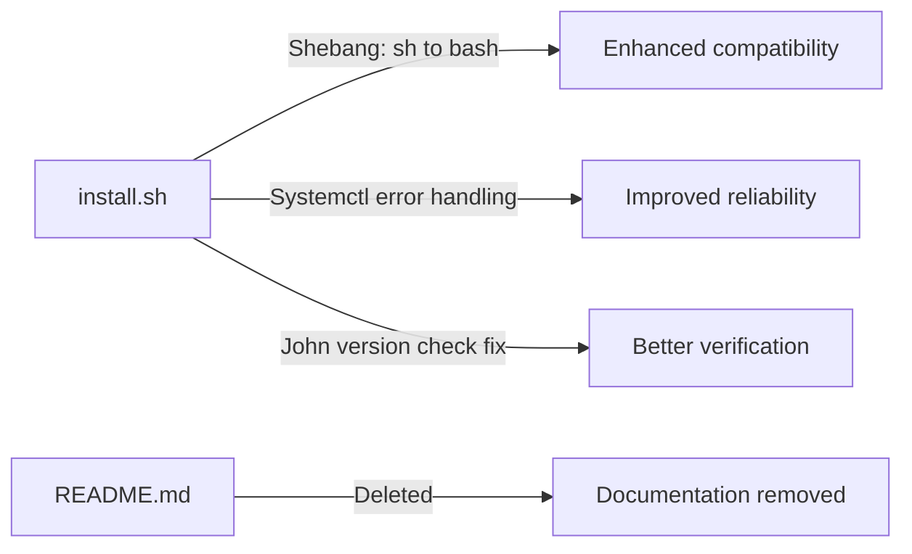

# Diagrams from Pull Request #6

## Flow Diagram for Updated Firewall, Service Disabling, and Verification Logic in install.sh

```mermaid
flowchart TD
    A[Start firewall configuration] --> B[ufw allow out http]
    B --> C[ufw allow out https]
    C --> D[ufw allow out domain]
    D --> E[ufw enable]
    E --> F[check_error Firewall configuration]

    F --> G[systemctl disable bluetooth 2>/dev/null || true]
    G --> H[systemctl disable cups 2>/dev/null || true]
    H --> I[check_error Disabling unnecessary services]

    I --> J[Append ufw status to LOG_FILE]
    J --> K[Run nmap --version and append to LOG_FILE]
    K --> L[Run burpsuite --version and append to LOG_FILE]
    L --> M[Run sqlmap --version and append to LOG_FILE]
    M --> N[Run john | head -1 and append to LOG_FILE]
    N --> O{Command success?}
    O -- No --> P[log YELLOW John verification failed]
    O -- Yes --> Q[Continue]

    Q --> R{SecLists directory exists at /home/TARGET_USER/tools/SecLists?}
    R -- Yes --> S[ls Passwords subdirectory and append to LOG_FILE]
    S --> T{ls success?}
    T -- No --> U[log YELLOW SecLists verification failed]
    T -- Yes --> V[Continue]
    R -- No --> V[Skip SecLists verification]

    V --> W[End of verification section]
```

## Diagram Walkthrough



## File Walkthrough

### Bug fix - install.sh
- **Fix script compatibility and error handling**
- Changed shebang from `#!/bin/sh` to `#!/bin/bash` for better script compatibility
- Split `systemctl disable bluetooth cups` into two separate commands with error suppression (`2>/dev/null || true`)
- Modified john version verification from `john --version` to `john | head -1` to handle output format differences

### Documentation - README.md
- **Remove complete README documentation**
- Entire file deleted (142 lines removed)
- Contained comprehensive documentation including overview, features, installation instructions, tool categories, directory structure, and troubleshooting guide

---
*Source: Pull Request #6 - "modified: README.md"*
