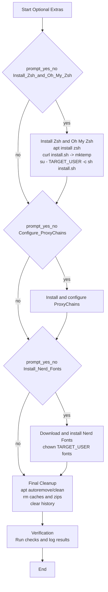
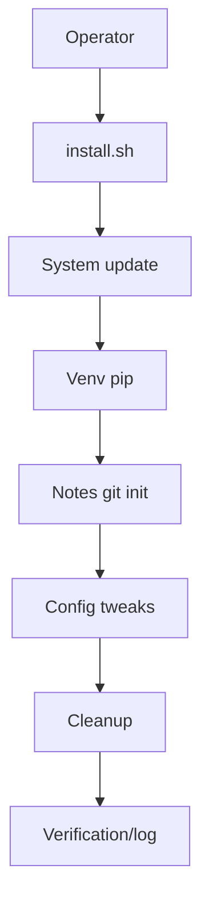

# Workflow Diagram

## Sourcery

```mermaid
flowchart TD
    A[Start Optional Extras] --> B{prompt_yes_no Install_Zsh_and_Oh_My_Zsh}
    B -- yes --> C[Install Zsh and Oh My Zsh
apt install zsh
curl install.sh -> mktemp
su - TARGET_USER -c sh install.sh]
    B -- no --> D
    C --> D{prompt_yes_no Configure_ProxyChains}
    D -- yes --> E[Install and configure ProxyChains]
    D -- no --> F
    E --> F{prompt_yes_no Install_Nerd_Fonts}
    F -- yes --> G[Download and install Nerd Fonts
chown TARGET_USER fonts]
    F -- no --> H
    G --> H[Final Cleanup
apt autoremove/clean
rm caches and zips
clear history]
    H --> I[Verification
Run checks and log results]
    I --> J[End]
```

## Qodo

```mermaid
graph TD
  U["Operator"] --> S["install.sh"] --> A["System update"] --> P["Venv pip"] --> G["Notes git init"] --> C["Config tweaks"] --> CL["Cleanup"] --> V["Verification/log"]
```
